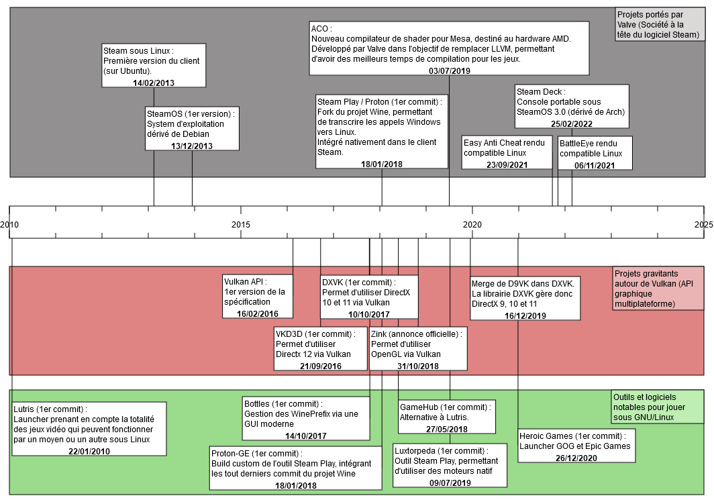

## Website : http://www.frisechronos.fr

## Note :
- 2010 : openGl, wine, PlayOnLinux
- 2014 : steamOS
- 2016 : Vulkan API

> ACO (compilateur de Shader pour AMD) :  
> https://www.phoronix.com/scan.php?page=article&item=radv-aco-llvm&num=1  
> https://www.gamingonlinux.com/2019/07/valves-new-aco-mesa-shader-compiler-for-amd-gpus-now-has-vertex-shader-support/

> zink (OpenGl over Vulkan) :  
> https://www.gamingonlinux.com/2021/11/the-zink-driver-for-opengl-over-vulkan-shows-good-performance-on-nvidia/
> https://www.collabora.com/news-and-blog/blog/2018/10/31/introducing-zink-opengl-implementation-vulkan/

> Gallium3D (interface unifiée pour accès/développement des driver graphiques) :  
> ça masque le driver derrière l'API Gallium, au prix d'une implémentation de plus haut niveau.
> Exemple avec DirectX over OpenGL: https://linuxreviews.org/Gallium_Nine

> mesa3D :  
> DXVK : DirectX 9(https://www.phoronix.com/scan.php?page=news_item&px=D9VK-Merges-Into-DXVK)/10/11
> VKD3D : DirectX 12

- https://mesamatrix.net/
- https://www.game-debate.com/news/20774/id-software-using-directx-12-over-vulkan-literally-makes-no-sense
- https://www.gamingonlinux.com/2022/02/6-years-on-the-vulkan-api-has-enabled-some-amazing-things/
- https://store.steampowered.com/news/group/4145017/view/3104663180636096966
