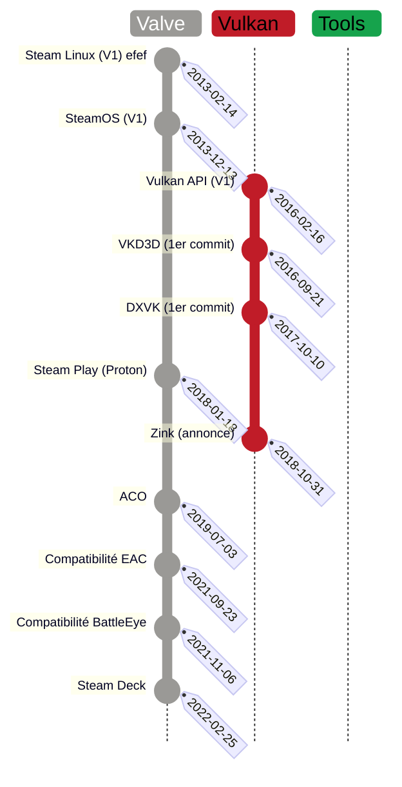

## Timeline
Visualiser la timeline dans [markwhen](https://timeline.markwhen.com#mw=I3ZhbHZlOiAjOWE5OTk2CiN2dWxrYW46ICNjMDFjMjgKI3Rvb2xzOiAjMTZhMzRjCiNnbG9kOiAjZjVjMjExCgp0aXRsZTogTGludXggR2FtaW5nCgojZHJpdmVyOiAjODEzZDljCnNlY3Rpb24gVmFsdmUgI3ZhbHZlCjIwMTMtMDItMTQ6IFN0ZWFtIExpbnV4IChWMSkgI3ZhbHZlClByZW1p6HJlIHZlcnNpb24gZHUgY2xpZW50IChzb3VzIFVidW50dSkgCgoyMDEzLTEyLTEzOiBTdGVhbU9TIChWMSkgI3ZhbHZlClN5c3TobWUgZCdleHBsb2l0YXRpb24gZOlyaXbpIGRlIERlYmlhbgoKMjAxOC0wMS0xODogU3RlYW0gUGxheSAoUHJvdG9uKSAjZ2xvZApGb3JrIGR1IHByb2pldCBXaW5lIHBlcm1ldHRhbnQgZGUgdHJhbnNjcmlyZSBsZXMgYXBwZWxzIFdpbmRvd3MgdmVycyBMaW51eC4KSW506Wdy6SBuYXRpdmVtZW50IGRhbnMgbGUgY2xpZW50IFN0ZWFtLgoKMjAxOS0wNy0wMzogQUNPICN2YWx2ZQpDb21waWxhdGV1ciBkZSBzaGFkZXIgcG91ciBNZXNhLCBk6XN0aW7pIGF1IGhhcmR3YXJlIEFNRC4KROl2ZWxvcHDpIHBhciBWYWx2ZSBhZmluIGRlIHJlbXBsYWNlciBMTFZNLgpQZXJtZXQgZCdhdm9pciBkZXMgbWVpbGxldXJzIHRlbXBzIGRlIHLpcG9uc2UgZW4gamV1eC4KCjIwMjEtMDktMjM6IEVBQyAjdmFsdmUKRWFzeSBBbnRpIENoZWF0IHJlbmR1IGNvbXBhdGlibGUgcG91ciBHTlUvTGludXgKCjIwMjEtMTEtMDY6IEJhdHRsZUV5ZSAjdmFsdmUKU3lzdOhtZSBhbnRpIGNoZWF0IHJlbmR1IGNvbXBhdGlibGUgcG91ciBHTlUvTGludXgKCjIwMjItMDItMjU6IFN0ZWFtIERlY2sgI3ZhbHZlCkNvbnNvbGUgcG9ydGFibGUgc291cyBTdGVhbU9TIDMuMCAoZOlyaXbpIGRlIEFyY2gpCmVuZFNlY3Rpb24KCgpzZWN0aW9uIFZ1bGthbiAjdnVsa2FuCjIwMTYtMDItMTY6IFZ1bGthbiBBUEkgKFYxKSAjZ2xvZAox6HJlIHZlcnNpb24gZGUgbGEgc3DpY2lmaWNhdGlvbgoKMjAxNi0wOS0yMTogVktEM0QgKDFlciBjb21taXQpICN2dWxrYW4KVHJhZHVpdCBsZXMgYXBwZWxzIERpcmVjdFggMTIgdmlhIFZ1bGthbgoKMjAxNy0xMC0xMDogRFhWSyAoMWVyIGNvbW1pdCkgI3Z1bGthbgpUcmFkdWl0IGxlcyBhcHBlbHMgRGlyZWN0WCAxMCBldCAxMSB2aWEgVnVsa2FuCgoyMDE4LTEwLTMxOiBaaW5rIChhbm5vbmNlKSAjdnVsa2FuClRyYWR1aXQgbGVzIGFwcGVscyBPcGVuR0wgdmlhIFZ1bGthbgoKMjAxOS0xMi0xNjogRDlWSyBtZXJn6SBkYW5zIERYVksgI3Z1bGthbgpMYSBsaWJyYWlyaWUgRFhWSyBn6HJlIG1haW50ZW5hbnQgRGlyZWN0WCA5LCAxMCBldCAxMQplbmRTZWN0aW9uCgoKc2VjdGlvbiBPdXRpbHMgI3Rvb2xzCjIwMTAtMDEtMjI6IEx1dHJpcyAoMWVyIGNvbW1pdCkgI3Rvb2xzCkxhdW5jaGVyIGdyYXBoaXF1ZSBpbnTpZ3JhbnQgYmVhdWNvdXAgZGUgY29uZmlndXJhdGlvbnMgZGlmZulyZW50ZXMgcG91ciBmYWlyZSB0b3VybmVyIGRlcyBqZXV4IHNvdXMgR05VL0xpbnV4LgpMJ291dGlscyByZXBvc2UgcHJpbmNpcGFsZW1lbnQgc3VyIFdpbmUuCgoyMDE3LTEwLTE0OiBCb3R0bGVzICgxZXIgY29tbWl0KSAjdG9vbHMKR2VzdGlvbiBkZXMgV2luZVByZWZpeCB2aWEgdW5lIEdVSQoKMjAxOC0wMS0xODogUHJvdG9uLUdFICgxZXIgY29tbWl0KSAjdG9vbHMKQnVpbGQgY3VzdG9tIGRlIGwnb3V0aWxzIFN0ZWFtIFBsYXkgKFByb3RvbikuCklsIGEgbCdhdmFudGFnZSBkJ3Vwc3RyZWFtIGJlYXVjb3VwIGRlIGZlYXR1cmUgZHUgcHJvamV0IFdpbmUuCgoyMDE4LTA1LTI3OiBHYW1lSHViICgxZXIgY29tbWl0KSAjdG9vbHMKQWx0ZXJuYXRpdmUg4CBMdXRyaXMKCjIwMTktMDctMDk6IEx1eHRvcnBlZGEgKDFlciBjb21taXQpICN0b29scwpPdXRpbHMgU3RlYW0gUGxheSBwZXJtZXR0YW50IGQndXRpbGlzZXIgZGVzIG1vdGV1cnMgZGUgamV1eCBvcGVuIHNvdXJjZSBhbHRlcm5hdGlmCgoyMDIwLTAxLTA1OiBabHVkYSAoMWVyIGNvbW1pdCkgI3Rvb2xzClBlcm1ldCBkZSBmYWlyZSB0b3VybmVyIGRlcyBwcm9ncmFtbWVzIENVREEgc3VyIHVuZSBhcmNoaXRlY3R1cmUgQU1ELgpbR2l0SHViXShodHRwczovL2dpdGh1Yi5jb20vdm9zZW4vWkxVREEpCgoyMDIwLTEyLTI2OiBIZXJvaWMgR2FtZXMgKDFlciBjb21taXV0KSAjdG9vbHMKTGF1bmNoZXIgcG91ciBsZXMgc3RvcmUgR09HIGV0IEVwaWMgR2FtZXMKZW5kU2VjdGlvbgoKCnNlY3Rpb24gRHJpdmVyICNkcml2ZXIKMjAyNC0wMy0wNjogUjU1MCBzdGFibGUgI2RyaXZlcgpMZSBtb2R1bGUgbm95YXUsIG9wZW4gc291cmNlLCBk6XZlbG9wcOkgcGFyIE52aWRpYSBlc3QgY29uc2lk6XLpIGNvbW1lICJzdGFibGUiLgpE6WxpdnJlIGRlcyBbcGVyZm9ybWFuY2VzIHNpbWlsYWlyZXNdKGh0dHBzOi8vd3d3LnBob3Jvbml4LmNvbS9yZXZpZXcvbnZpZGlhLXI1NTAtb3BlbikgYXUgZHJpdmVyIHByb3Byael0YWlyZSAKCjIwMjQtMDMtMjA6IE5vdmEgKGFubm9uY2UpICNkcml2ZXIKRHJpdmVyIG9wZW4gc291cmNlIGTpdmVsb3Bw6SBwYXIgUmVkIEhhdC4KW1NvdXJjZV0oaHR0cHM6Ly93d3cuZ2FtaW5nb25saW51eC5jb20vMjAyNC8wMy9ub3ZhLWEtcnVzdC1iYXNlZC1saW51eC1kcml2ZXItZm9yLW52aWRpYS1ncHVzLWFubm91bmNlZC8pCmVuZFNlY3Rpb24=)

## Mermaid version
Test de différents diagrammes.

## Note :
- 2010 : openGl, wine, PlayOnLinux
- 2014 : steamOS
- 2016 : Vulkan API

> ACO (compilateur de Shader pour AMD) :  
> https://www.phoronix.com/scan.php?page=article&item=radv-aco-llvm&num=1  
> https://www.gamingonlinux.com/2019/07/valves-new-aco-mesa-shader-compiler-for-amd-gpus-now-has-vertex-shader-support/

> zink (OpenGl over Vulkan) :  
> https://www.gamingonlinux.com/2021/11/the-zink-driver-for-opengl-over-vulkan-shows-good-performance-on-nvidia/  
> https://www.collabora.com/news-and-blog/blog/2018/10/31/introducing-zink-opengl-implementation-vulkan/

> Gallium3D (interface unifiée pour accès/développement des driver graphiques) :  
> ça masque le driver derrière l'API Gallium, au prix d'une implémentation de plus haut niveau.  
> Exemple avec DirectX over OpenGL: https://linuxreviews.org/Gallium_Nine

> mesa3D :  
> DXVK : DirectX 9(https://www.phoronix.com/scan.php?page=news_item&px=D9VK-Merges-Into-DXVK)/10/11  
> VKD3D : DirectX 12

> A ranger :  
> https://mesamatrix.net/  
> https://www.game-debate.com/news/20774/id-software-using-directx-12-over-vulkan-literally-makes-no-sense  
> https://www.gamingonlinux.com/2022/02/6-years-on-the-vulkan-api-has-enabled-some-amazing-things/  
> https://store.steampowered.com/news/group/4145017/view/3104663180636096966  

> Nvidia :  
> Nvidia driver : nouveau/nvk (driver open source historique), nova (driver open source développé par Red Hat), kernel module (pas de nom, mais c'est open source et développé par Nvidia)  
> https://www.gamingonlinux.com/2024/07/dxvk-24-brings-d8vk-for-direct3d-8-support-frame-rate-limiter-adjustments-lots-of-game-fixes/  
> https://developer.nvidia.com/blog/nvidia-transitions-fully-towards-open-source-gpu-kernel-modules/  

> Umu / ULWGL (SteamRuntime hors de Steam) :  
> 21/01/2024 : https://github.com/GloriousEggroll/ULWGL/commit/f8d3e7df6e7d3fcf466bf0fb26bf38e55df40ffe
