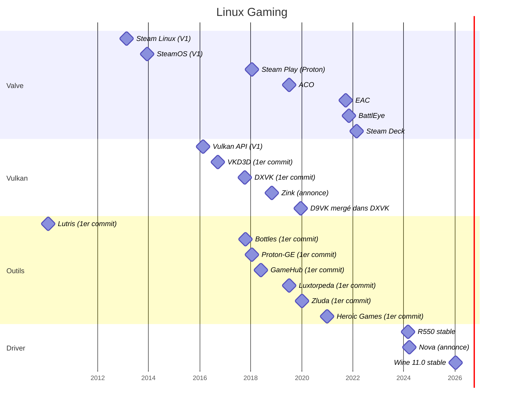

# Timeline
Visualiser la timeline dans [markwhen](https://timeline.markwhen.com#mw=I3ZhbHZlOiAjOWE5OTk2CiN2dWxrYW46ICNjMDFjMjgKI3Rvb2xzOiAjMTZhMzRjCiNnbG9kOiAjZjVjMjExCgp0aXRsZTogTGludXggR2FtaW5nCgojZHJpdmVyOiAjODEzZDljCnNlY3Rpb24gVmFsdmUgI3ZhbHZlCjIwMTMtMDItMTQ6IFN0ZWFtIExpbnV4IChWMSkgI3ZhbHZlClByZW1p6HJlIHZlcnNpb24gZHUgY2xpZW50IChzb3VzIFVidW50dSkgCgoyMDEzLTEyLTEzOiBTdGVhbU9TIChWMSkgI3ZhbHZlClN5c3TobWUgZCdleHBsb2l0YXRpb24gZOlyaXbpIGRlIERlYmlhbgoKMjAxOC0wMS0xODogU3RlYW0gUGxheSAoUHJvdG9uKSAjZ2xvZApGb3JrIGR1IHByb2pldCBXaW5lIHBlcm1ldHRhbnQgZGUgdHJhbnNjcmlyZSBsZXMgYXBwZWxzIFdpbmRvd3MgdmVycyBMaW51eC4KSW506Wdy6SBuYXRpdmVtZW50IGRhbnMgbGUgY2xpZW50IFN0ZWFtLgoKMjAxOS0wNy0wMzogQUNPICN2YWx2ZQpDb21waWxhdGV1ciBkZSBzaGFkZXIgcG91ciBNZXNhLCBk6XN0aW7pIGF1IGhhcmR3YXJlIEFNRC4KROl2ZWxvcHDpIHBhciBWYWx2ZSBhZmluIGRlIHJlbXBsYWNlciBMTFZNLgpQZXJtZXQgZCdhdm9pciBkZXMgbWVpbGxldXJzIHRlbXBzIGRlIHLpcG9uc2UgZW4gamV1eC4KCjIwMjEtMDktMjM6IEVBQyAjdmFsdmUKRWFzeSBBbnRpIENoZWF0IHJlbmR1IGNvbXBhdGlibGUgcG91ciBHTlUvTGludXgKCjIwMjEtMTEtMDY6IEJhdHRsZUV5ZSAjdmFsdmUKU3lzdOhtZSBhbnRpIGNoZWF0IHJlbmR1IGNvbXBhdGlibGUgcG91ciBHTlUvTGludXgKCjIwMjItMDItMjU6IFN0ZWFtIERlY2sgI3ZhbHZlCkNvbnNvbGUgcG9ydGFibGUgc291cyBTdGVhbU9TIDMuMCAoZOlyaXbpIGRlIEFyY2gpCmVuZFNlY3Rpb24KCgpzZWN0aW9uIFZ1bGthbiAjdnVsa2FuCjIwMTYtMDItMTY6IFZ1bGthbiBBUEkgKFYxKSAjZ2xvZAox6HJlIHZlcnNpb24gZGUgbGEgc3DpY2lmaWNhdGlvbgoKMjAxNi0wOS0yMTogVktEM0QgKDFlciBjb21taXQpICN2dWxrYW4KVHJhZHVpdCBsZXMgYXBwZWxzIERpcmVjdFggMTIgdmlhIFZ1bGthbgoKMjAxNy0xMC0xMDogRFhWSyAoMWVyIGNvbW1pdCkgI3Z1bGthbgpUcmFkdWl0IGxlcyBhcHBlbHMgRGlyZWN0WCAxMCBldCAxMSB2aWEgVnVsa2FuCgoyMDE4LTEwLTMxOiBaaW5rIChhbm5vbmNlKSAjdnVsa2FuClRyYWR1aXQgbGVzIGFwcGVscyBPcGVuR0wgdmlhIFZ1bGthbgoKMjAxOS0xMi0xNjogRDlWSyBtZXJn6SBkYW5zIERYVksgI3Z1bGthbgpMYSBsaWJyYWlyaWUgRFhWSyBn6HJlIG1haW50ZW5hbnQgRGlyZWN0WCA5LCAxMCBldCAxMQplbmRTZWN0aW9uCgoKc2VjdGlvbiBPdXRpbHMgI3Rvb2xzCjIwMTAtMDEtMjI6IEx1dHJpcyAoMWVyIGNvbW1pdCkgI3Rvb2xzCkxhdW5jaGVyIGdyYXBoaXF1ZSBpbnTpZ3JhbnQgYmVhdWNvdXAgZGUgY29uZmlndXJhdGlvbnMgZGlmZulyZW50ZXMgcG91ciBmYWlyZSB0b3VybmVyIGRlcyBqZXV4IHNvdXMgR05VL0xpbnV4LgpMJ291dGlscyByZXBvc2UgcHJpbmNpcGFsZW1lbnQgc3VyIFdpbmUuCgoyMDE3LTEwLTE0OiBCb3R0bGVzICgxZXIgY29tbWl0KSAjdG9vbHMKR2VzdGlvbiBkZXMgV2luZVByZWZpeCB2aWEgdW5lIEdVSQoKMjAxOC0wMS0xODogUHJvdG9uLUdFICgxZXIgY29tbWl0KSAjdG9vbHMKQnVpbGQgY3VzdG9tIGRlIGwnb3V0aWxzIFN0ZWFtIFBsYXkgKFByb3RvbikuCklsIGEgbCdhdmFudGFnZSBkJ3Vwc3RyZWFtIGJlYXVjb3VwIGRlIGZlYXR1cmUgZHUgcHJvamV0IFdpbmUuCgoyMDE4LTA1LTI3OiBHYW1lSHViICgxZXIgY29tbWl0KSAjdG9vbHMKQWx0ZXJuYXRpdmUg4CBMdXRyaXMKCjIwMTktMDctMDk6IEx1eHRvcnBlZGEgKDFlciBjb21taXQpICN0b29scwpPdXRpbHMgU3RlYW0gUGxheSBwZXJtZXR0YW50IGQndXRpbGlzZXIgZGVzIG1vdGV1cnMgZGUgamV1eCBvcGVuIHNvdXJjZSBhbHRlcm5hdGlmCgoyMDIwLTAxLTA1OiBabHVkYSAoMWVyIGNvbW1pdCkgI3Rvb2xzClBlcm1ldCBkZSBmYWlyZSB0b3VybmVyIGRlcyBwcm9ncmFtbWVzIENVREEgc3VyIHVuZSBhcmNoaXRlY3R1cmUgQU1ELgpbR2l0SHViXShodHRwczovL2dpdGh1Yi5jb20vdm9zZW4vWkxVREEpCgoyMDIwLTEyLTI2OiBIZXJvaWMgR2FtZXMgKDFlciBjb21taXV0KSAjdG9vbHMKTGF1bmNoZXIgcG91ciBsZXMgc3RvcmUgR09HIGV0IEVwaWMgR2FtZXMKZW5kU2VjdGlvbgoKCnNlY3Rpb24gRHJpdmVyICNkcml2ZXIKMjAyNC0wMy0wNjogUjU1MCBzdGFibGUgI2RyaXZlcgpMZSBtb2R1bGUgbm95YXUsIG9wZW4gc291cmNlLCBk6XZlbG9wcOkgcGFyIE52aWRpYSBlc3QgY29uc2lk6XLpIGNvbW1lICJzdGFibGUiLgpE6WxpdnJlIGRlcyBbcGVyZm9ybWFuY2VzIHNpbWlsYWlyZXNdKGh0dHBzOi8vd3d3LnBob3Jvbml4LmNvbS9yZXZpZXcvbnZpZGlhLXI1NTAtb3BlbikgYXUgZHJpdmVyIHByb3Byael0YWlyZSAKCjIwMjQtMDMtMjA6IE5vdmEgKGFubm9uY2UpICNkcml2ZXIKRHJpdmVyIG9wZW4gc291cmNlIGTpdmVsb3Bw6SBwYXIgUmVkIEhhdC4KW1NvdXJjZV0oaHR0cHM6Ly93d3cuZ2FtaW5nb25saW51eC5jb20vMjAyNC8wMy9ub3ZhLWEtcnVzdC1iYXNlZC1saW51eC1kcml2ZXItZm9yLW52aWRpYS1ncHVzLWFubm91bmNlZC8pCmVuZFNlY3Rpb24=)

# Gantt version

## 🐧 Linux Gaming — Timeline

```mermaid
gantt
    title Linux Gaming
    dateFormat YYYY-MM-DD
    axisFormat %Y

    section Valve
    Steam Linux (V1)      :milestone, 2013-02-14, 0d
    SteamOS (V1)          :milestone, 2013-12-13, 0d
    Steam Play (Proton)   :milestone, 2018-01-18, 0d
    ACO                   :milestone, 2019-07-03, 0d
    EAC                   :milestone, 2021-09-23, 0d
    BattlEye              :milestone, 2021-11-06, 0d
    Steam Deck            :milestone, 2022-02-25, 0d

    section Vulkan
    Vulkan API (V1)       :milestone, 2016-02-16, 0d
    VKD3D (1er commit)    :milestone, 2016-09-21, 0d
    DXVK (1er commit)     :milestone, 2017-10-10, 0d
    Zink (annonce)        :milestone, 2018-10-31, 0d
    D9VK mergé dans DXVK  :milestone, 2019-12-16, 0d

    section Outils
    Lutris (1er commit)        :milestone, 2010-01-22, 0d
    Bottles (1er commit)       :milestone, 2017-10-14, 0d
    Proton-GE (1er commit)     :milestone, 2018-01-18, 0d
    GameHub (1er commit)       :milestone, 2018-05-27, 0d
    Luxtorpeda (1er commit)    :milestone, 2019-07-09, 0d
    Zluda (1er commit)         :milestone, 2020-01-05, 0d
    Heroic Games (1er commit)  :milestone, 2020-12-26, 0d

    section Driver
    R550 stable           :milestone, 2024-03-06, 0d
    Nova (annonce)        :milestone, 2024-03-20, 0d
    Wine 11.0 stable      :milestone, 2026-01-13, 0d
```

---

## 🎮 Valve

- **Steam Linux (V1)** — Première version du client (sous Ubuntu)
- **SteamOS (V1)** — Système d'exploitation dérivé de Debian
- **Steam Play (Proton)** — Fork du projet Wine permettant de transcrire les appels Windows vers Linux. Intégré nativement dans le client Steam.
- **ACO** — Compilateur de shader pour Mesa, destiné au hardware AMD. Développé par Valve afin de remplacer LLVM. Permet d'avoir de meilleurs temps de réponse en jeux.
- **EAC** — Easy Anti Cheat rendu compatible pour GNU/Linux
- **BattlEye** — Système anti-cheat rendu compatible pour GNU/Linux
- **Steam Deck** — Console portable sous SteamOS 3.0 (dérivé d'Arch)

## 🌋 Vulkan

- **Vulkan API (V1)** — 1ère version de la spécification
- **VKD3D** (1er commit) — Traduit les appels DirectX 12 via Vulkan
- **DXVK** (1er commit) — Traduit les appels DirectX 10 et 11 via Vulkan
- **Zink** (annonce) — Traduit les appels OpenGL via Vulkan
- **D9VK mergé dans DXVK** — La librairie DXVK gère maintenant DirectX 9, 10 et 11

## 🛠️ Outils

- **Lutris** (1er commit) — Launcher graphique intégrant beaucoup de configurations différentes pour faire tourner des jeux sous GNU/Linux. Repose principalement sur Wine.
- **Bottles** (1er commit) — Gestion des WinePrefix via une GUI
- **Proton-GE** (1er commit) — Build custom de l'outil Steam Play (Proton). A l'avantage d'upstream beaucoup de features du projet Wine.
- **GameHub** (1er commit) — Alternative à Lutris
- **Luxtorpeda** (1er commit) — Outil Steam Play permettant d'utiliser des moteurs de jeux open source alternatifs
- **Zluda** (1er commit) — Permet de faire tourner des programmes CUDA sur une architecture AMD. ([GitHub](https://github.com/vosen/ZLUDA))
- **Heroic Games** (1er commit) — Launcher pour les stores GOG et Epic Games

## 🖥️ Driver

- **R550 stable** — Le module noyau, open source, développé par Nvidia est considéré comme "stable". Délivre des [performances similaires](https://www.phoronix.com/review/nvidia-r550-open) au driver propriétaire.
- **Nova** (annonce) — Driver open source développé par Red Hat. ([Source](https://www.gamingonlinux.com/2024/03/nova-a-rust-based-linux-driver-for-nvidia-gpus-announced/))
- **Wine 11.0 stable** — Ajout de NTSync et WoW64 ! ([Source](https://www.xda-developers.com/wine-11-rewrites-linux-runs-windows-games-speed-gains/))

---

## Note :
- 2010 : openGl, wine, PlayOnLinux
- 2014 : steamOS
- 2016 : Vulkan API

> ACO (compilateur de Shader pour AMD) :  
> https://www.phoronix.com/scan.php?page=article&item=radv-aco-llvm&num=1  
> https://www.gamingonlinux.com/2019/07/valves-new-aco-mesa-shader-compiler-for-amd-gpus-now-has-vertex-shader-support/

> zink (OpenGl over Vulkan) :  
> https://www.gamingonlinux.com/2021/11/the-zink-driver-for-opengl-over-vulkan-shows-good-performance-on-nvidia/  
> https://www.collabora.com/news-and-blog/blog/2018/10/31/introducing-zink-opengl-implementation-vulkan/

> Gallium3D (interface unifiée pour accès/développement des driver graphiques) :  
> ça masque le driver derrière l'API Gallium, au prix d'une implémentation de plus haut niveau.  
> Exemple avec DirectX over OpenGL: https://linuxreviews.org/Gallium_Nine

> mesa3D :  
> DXVK : DirectX 9(https://www.phoronix.com/scan.php?page=news_item&px=D9VK-Merges-Into-DXVK)/10/11  
> VKD3D : DirectX 12

> A ranger :  
> https://mesamatrix.net/  
> https://www.game-debate.com/news/20774/id-software-using-directx-12-over-vulkan-literally-makes-no-sense  
> https://www.gamingonlinux.com/2022/02/6-years-on-the-vulkan-api-has-enabled-some-amazing-things/  
> https://store.steampowered.com/news/group/4145017/view/3104663180636096966  

> Nvidia :  
> Nvidia driver : nouveau/nvk (driver open source historique), nova (driver open source développé par Red Hat), kernel module (pas de nom, mais c'est open source et développé par Nvidia)  
> https://www.gamingonlinux.com/2024/07/dxvk-24-brings-d8vk-for-direct3d-8-support-frame-rate-limiter-adjustments-lots-of-game-fixes/  
> https://developer.nvidia.com/blog/nvidia-transitions-fully-towards-open-source-gpu-kernel-modules/  

> Umu / ULWGL (SteamRuntime hors de Steam) :  
> 21/01/2024 : https://github.com/GloriousEggroll/ULWGL/commit/f8d3e7df6e7d3fcf466bf0fb26bf38e55df40ffe
